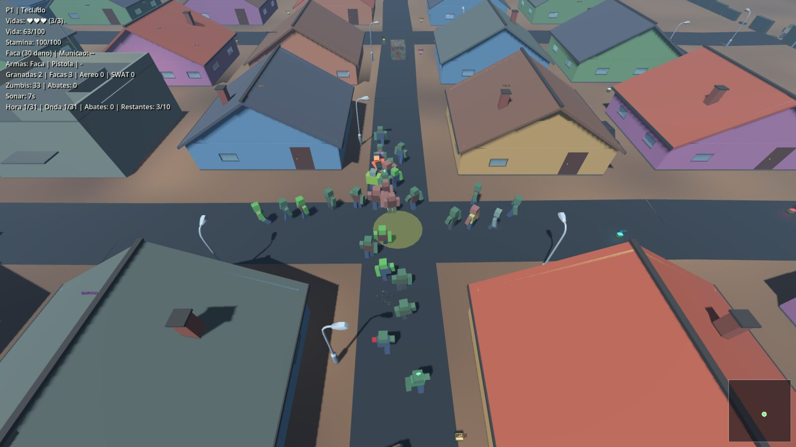
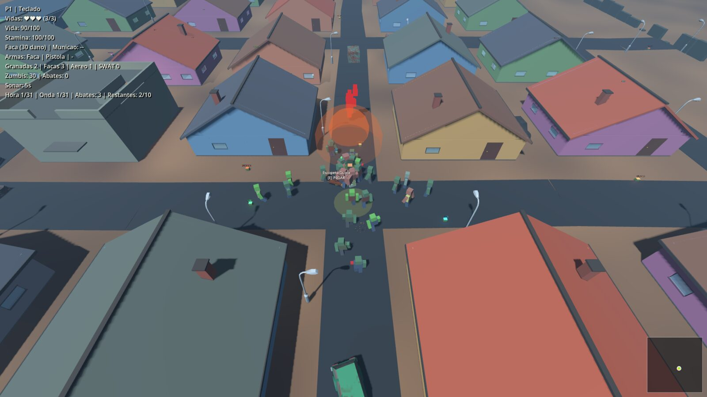
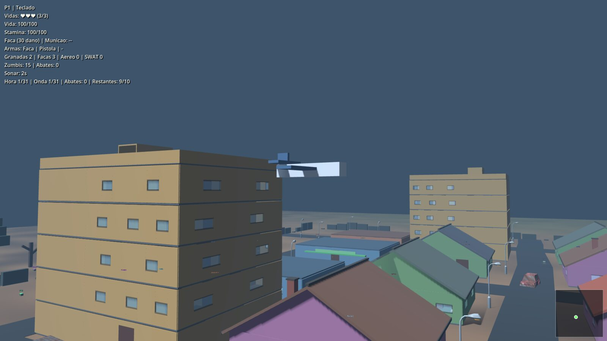
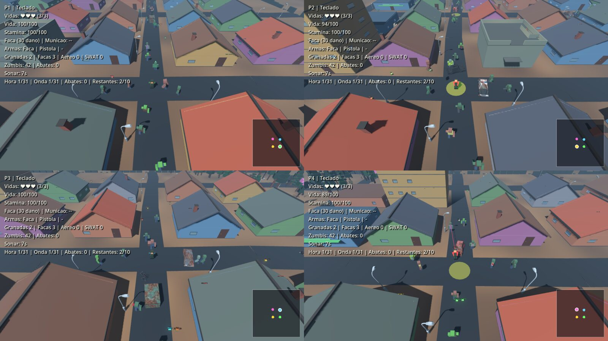
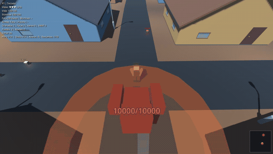

# Box Godot

Jogo de zumbis em Godot 4 com três modos: **sobrevivência** (ondas de zumbis,
loot, safehouse), **mata-mata por times** (TDM: duas bases, placar contínuo de
abates, arma à escolha) e **clássico** (zumbis sem progressão de onda). Cada
modo é um container próprio no servidor. Roda em janela única ou tela dividida
(até 4 jogadores locais), com servidor dedicado e cliente para Linux, Windows e
macOS.

> **Proof of concept.** Projeto pessoal, feito só para me expor ao Godot e a
> coisas de jogo. O jogo fica como está — não pretendo continuar evoluindo: no
> futuro o foco vira pods, containers e infra.

Autor: Vitor Holanda.

## Imagens



Vista de cima durante o jogo, com o HUD (vidas, munição, abates, sonar) e o minimapa.



Ataque aereo: o alvo e marcado no chao e as bombas caem em linha sobre a horda.



Airdrop: o aviao cruza baixo sobre as ruas e o crate de armas desce de paraquedas.


Mata-mata por times: o menu de arma (tecla B) com o arsenal inteiro de graca, o
time do jogador e o placar `Azul x Vermelho`.


Fim de partida, com o placar de abates dos dois times.



Tela dividida 2x2, com um HUD por jogador: ate 4 jogadores locais na mesma tela,
cada um com seu dispositivo (teclado ou controle).

### Zumbis

Sao 21 variantes, cada uma com aparencia, vida, velocidade e habilidade proprias.
O Tita (chefe) e a mais brutal:



Todos os 21 GIFs (um por variante, gravados pelo proprio jogo) estao em
[`docs/zumbis.md`](docs/zumbis.md); as demais imagens de gameplay estao em
[`docs/imagens/`](docs/imagens/). Tudo isso e gerado por
`scripts/capture_shots.sh`.

## Requisitos

- Godot **4.7.2** (padrão do projeto; use a mesma versão para servidor e
  cliente)
- Docker com `docker compose` (servidor local/VPS)

## Como rodar

```bash
# editor (desenvolvimento)
godot --path . --editor

# cliente conectando num servidor (mesmo build do servidor)
godot --path . -- --join=127.0.0.1 --server-port=27015

# servidor dedicado direto pelo Godot (sobrevivência)
godot --headless --path . -- --server --server-port=27015 --survival

# servidor via Docker: um container POR MODO, você escolhe qual sobe
docker compose --profile survival up -d --build   # sobrevivência, porta 27015
docker compose --profile tdm up -d --build        # mata-mata, porta 27017
scripts/server_menu.sh            # menu interativo (faz o mesmo)
scripts/server_menu.sh tdm up     # mata-mata (sem bots)
PVP_BOTS=4 scripts/server_menu.sh tdm up   # com 4 bots, para testar
```

Portas: **27015/udp** (sobrevivência), **27017/udp** (mata-mata), **27019/udp**
(clássico); a porta seguinte de cada uma é a descoberta de salas na LAN. Não
abra TCP.

## Modos

Cada modo é um serviço próprio no `compose.yaml`, com porta e container
próprios, escolhido pelo profile — dá para deixar mais de um no ar ao mesmo
tempo. Ver [modos e containers](docs/modos-e-containers.md).

- **Sobrevivência**: ondas progressivas até 600 zumbis vivos, safehouse com 3
  vidas por jogador, arma que desgasta e munição escassa.
- **Mata-mata por times (TDM)**: duas bases em cantos opostos, 2 times de uma
  cor cada, placar contínuo até 50 abates (teto de 10 min), respawn em 5 s com
  4 s de invulnerabilidade e **arma à escolha, de graça**. Sem fogo amigo.
  Munição abundante e arma sem durabilidade. Bots de teste opcionais.
- **Clássico**: zumbis sem a progressão de ondas do survival.

## Controles

- `WASD`: movimentar
- `Espaco`: pular
- `Shift`: correr
- `1` / `2`: faca / pistola
- Clique esquerdo ou `F`: atacar
- `R`: recarregar
- `B`: menu de arma (só no mata-mata)
- `Esc`: menu da partida (pausa no local, continua no servidor)

No gamepad: analógico esquerdo move; `A` pula, `B` corre, `X` ataca, `LB`/`RB`
facas/pistola, `Y` recarrega. Cada jogador remapeia o próprio controle no menu.

## Estrutura

```
scripts/          lógica do jogo (rede, jogador, zumbis, cidade, PVP, testes)
scenes/           cenas e modelos
shaders/          shaders
compose.yaml      servidor dedicado em Docker
dist/             clientes exportados (gerados, não versionados)
docs/             documentação detalhada
```

## Documentação

- [`docs/`](docs/README.md) — índice da documentação
- [Cidade e mundo](docs/cidade-e-mundo.md)
- [Mecânicas](docs/mecanicas.md)
- [Multiplayer e servidor](docs/multiplayer.md)
- [Modo mata-mata por times (TDM)](docs/pvp.md)
- [Modos e containers](docs/modos-e-containers.md)
- [Desenvolvimento, builds e testes](docs/desenvolvimento.md)

## Testes

```bash
godot --headless --path . -- --unit-test     # suite completa
bash scripts/test_dedicated.sh               # servidor dedicado + bot
bash scripts/test_container.sh               # container Docker
```

Detalhes em [`docs/desenvolvimento.md`](docs/desenvolvimento.md).
