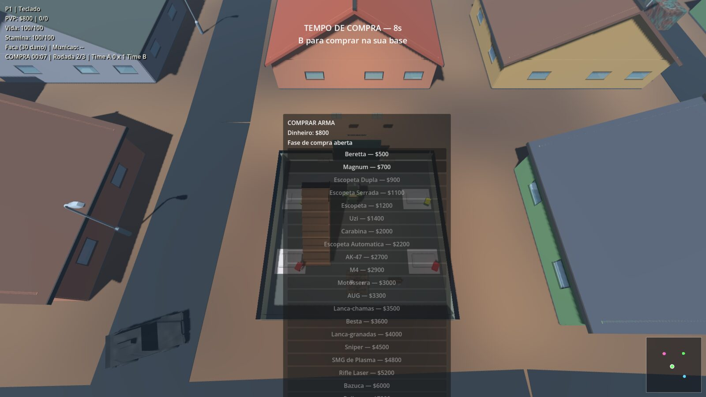
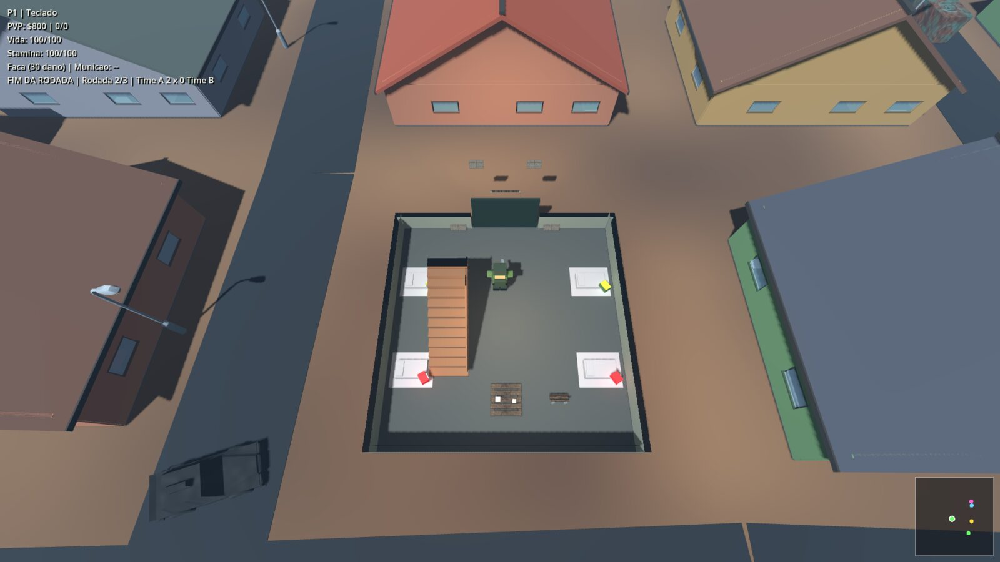

# Box Godot

Jogo de zumbis em Godot 4 com dois modos: **sobrevivência** (ondas de zumbis,
loot, safehouse) e **mata-mata PVP** (dois times, compra de armas, melhor de 3
rodadas). Roda em janela única ou tela dividida (até 4 jogadores locais), com
servidor dedicado e cliente para Linux, Windows e macOS.

Autor: Vitor Holanda.

## Imagens


Vista de cima durante o jogo, com o HUD (vidas, munição, abates, sonar) e o minimapa.


Ataque aereo: o alvo e marcado no chao e as bombas caem em linha sobre a horda.


Airdrop: o aviao cruza baixo sobre as ruas e o crate de armas desce de paraquedas.



Mata-mata PVP: tempo de compra na base, com o menu de armas e o placar `Time A x Time B`.



Fim de rodada por eliminacao, com o placar atualizado.


Tela dividida 2x2, com um HUD por jogador: ate 4 jogadores locais na mesma tela,
cada um com seu dispositivo (teclado ou controle).

### Zumbis

Sao 21 variantes, cada uma com aparencia, vida, velocidade e habilidade proprias.
O Tita (chefe) e a mais brutal:


Todos os 21 GIFs (um por variante, gravados pelo proprio jogo) estao em
[`docs/zumbis.md`](docs/zumbis.md); as demais imagens de gameplay estao em
[`docs/imagens/`](docs/imagens/). Tudo isso e gerado por
`scripts/capture_shots.sh`.

## Requisitos

- Godot **4.7.2** (padrão do projeto; use a mesma versão para servidor e
  cliente)
- Docker com `docker compose` (servidor local/VPS)

## Como rodar

```bash
# editor (desenvolvimento)
godot --path . --editor

# cliente conectando num servidor (mesmo build do servidor)
godot --path . -- --join=127.0.0.1 --server-port=27015

# servidor dedicado direto pelo Godot (sobrevivência)
godot --headless --path . -- --server --server-port=27015 --survival

# servidor via Docker, escolhendo o modo na hora
scripts/server_menu.sh            # menu interativo
scripts/server_menu.sh pvp up     # mata-mata (sem bots)
scripts/server_menu.sh survival up
PVP_BOTS=4 scripts/server_menu.sh pvp up   # com 4 bots, para testar
```

Portas: **27015/udp** (jogo) e **27016/udp** (descoberta de salas na LAN). Não
abra TCP.

## Modos

- **Sobrevivência**: ondas progressivas até 600 zumbis vivos, safehouse com 3
  vidas por jogador, arma que desgasta e munição escassa.
- **Mata-mata PVP**: duas bases em cantos opostos, compra de arma só na fase de
  compra e dentro da própria base, sem respawn durante a rodada, melhor de 3.
  Munição abundante e arma sem durabilidade. Bots de teste opcionais.

## Controles

- `WASD`: movimentar
- `Espaco`: pular
- `Shift`: correr
- `1` / `2`: faca / pistola
- Clique esquerdo ou `F`: atacar
- `R`: recarregar
- `B`: menu de compra (só no PVP)
- `Esc`: menu da partida (pausa no local, continua no servidor)

No gamepad: analógico esquerdo move; `A` pula, `B` corre, `X` ataca, `LB`/`RB`
facas/pistola, `Y` recarrega. Cada jogador remapeia o próprio controle no menu.

## Estrutura

```
scripts/          lógica do jogo (rede, jogador, zumbis, cidade, PVP, testes)
scenes/           cenas e modelos
shaders/          shaders
compose.yaml      servidor dedicado em Docker
dist/             clientes exportados (gerados, não versionados)
docs/             documentação detalhada
```

## Documentação

- [`docs/`](docs/README.md) — índice da documentação
- [Cidade e mundo](docs/cidade-e-mundo.md)
- [Mecânicas](docs/mecanicas.md)
- [Multiplayer e servidor](docs/multiplayer.md)
- [Modo mata-mata (PVP)](docs/pvp.md)
- [Desenvolvimento, builds e testes](docs/desenvolvimento.md)

## Testes

```bash
godot --headless --path . -- --unit-test     # suite completa
bash scripts/test_dedicated.sh               # servidor dedicado + bot
bash scripts/test_container.sh               # container Docker
```

Detalhes em [`docs/desenvolvimento.md`](docs/desenvolvimento.md).
