# Variantes de zumbi

Sao **21 variantes** (enum `ZombieMutator.Type` no `zombie_mutator.gd`): o tipo
muda aparencia, vida, velocidade e habilidade. A onda sorteia um mix percentual
por fase (`survival_wave_schedule.gd`), o hash sincroniza o visual entre servidor
e clientes, e as habilidades vivem em `zombie_variant_abilities.gd`.

Cada GIF abaixo foi gravado pelo proprio jogo: um zumbi da variante nasce na rua,
anda ate o jogador e ataca (`scripts/capture_shots.sh --gif`, com `--write-movie`
+ ffmpeg; detalhes em [`imagens/zumbis/README.md`](imagens/zumbis/README.md)).
Todos estao tambem soltos em [`imagens/zumbis/`](imagens/zumbis/), nomeados pelo
indice do enum (`zumbi-00.gif` ... `zumbi-20.gif`).

Vida e velocidade sao os valores base definidos no `zombie_mutator.gd`; algumas
variantes ajustam mais coisas no proprio setup (o Tita, por exemplo).

## 00 - Walker

Vida base **100** &middot; velocidade **2.2**. O classico: anda em linha reta para o jogador.

## 01 - Um braco

Vida base **85** &middot; velocidade **2.0**. Perdeu o braco esquerdo (sobra o coto).

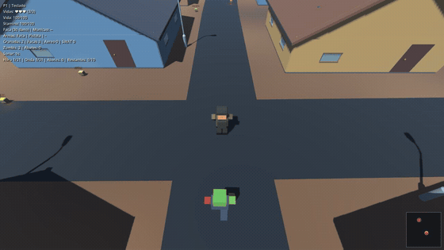

## 02 - Rastejante

Vida base **85** &middot; velocidade **1.2**. Arrasta o corpo pelo chao; mais baixo e mais lento.

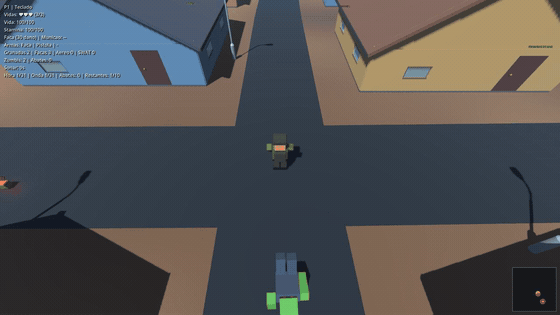

## 03 - Manco

Vida base **90** &middot; velocidade **1.65**. Perna torta: anda devagar e torto.

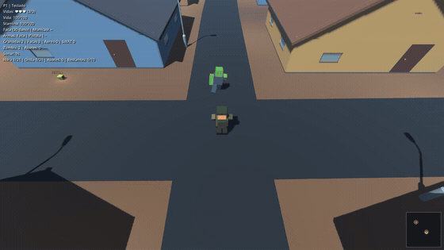

## 04 - Corredor

Vida base **70** &middot; velocidade **3.1**. Magro e inclinado para frente; corre mais que o walker.

## 05 - Braco pela metade

Vida base **90** &middot; velocidade **2.1**. Braco esquerdo cortado no meio.

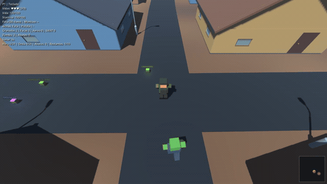

## 06 - Uma perna

Vida base **80** &middot; velocidade **1.5**. Perdeu a perna esquerda.

## 07 - Perna pela metade

Vida base **85** &middot; velocidade **1.6**. Perna direita cortada no meio; corpo inclinado.

## 08 - Cabeca dividida

Vida base **95** &middot; velocidade **2.3**. Cabeca partida em duas; anda rapido para o padrao.

## 09 - Brute (tanque)

Vida base **550** &middot; velocidade **1.15**. Lento, muita vida e golpe forte (26 de dano); corpo maior.

## 10 - Screamer

Vida base **85** &middot; velocidade **2.4**. Grita de tempo em tempo e atrai a horda pela audicao.

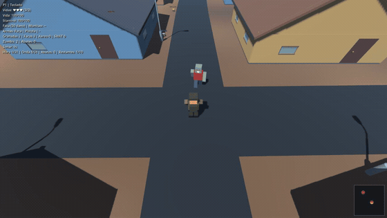

## 11 - Bloater kamikaze

Vida base **140** &middot; velocidade **3.2**. Inchado: corre e se joga no jogador para explodir colado.

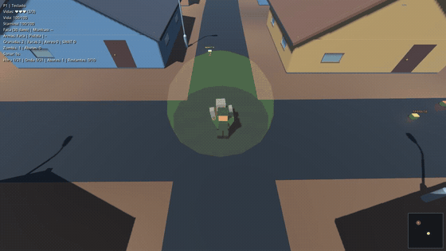

## 12 - Leaper

Vida base **70** &middot; velocidade **2.6**. Magro e curvado: da um bote rapido quando chega perto.

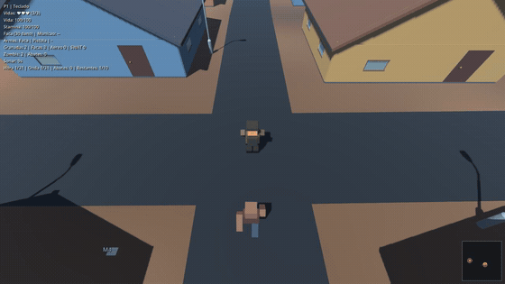

## 13 - Armored

Vida base **160** &middot; velocidade **1.9**. Capacete e colete: tiro causa metade do dano, faca dano cheio.

## 14 - Tita (chefe)

Vida base **10000** &middot; velocidade **1.7**. Super zumbi das horas 10/20/30: pisao, invocacao de sprinters e furia.

## 15 - Spitter (cuspidor)

Vida base **80** &middot; velocidade **2.0**. Para a distancia e cospe uma poca de acido que queima.

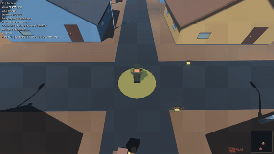

## 16 - Charger (investida)

Vida base **220** &middot; velocidade **1.9**. Braco gigante: arranca em linha reta e arremessa o jogador.

## 17 - Jumper (saltador)

Vida base **90** &middot; velocidade **2.5**. Pernas longas: pula em arco e cai em cima do jogador.

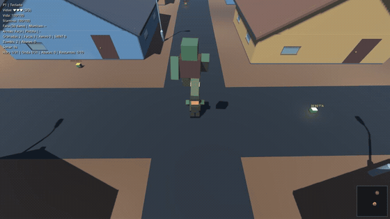

## 18 - Smoker (puxador)

Vida base **120** &middot; velocidade **1.9**. De longe prende o jogador com a lingua e puxa ate a horda.

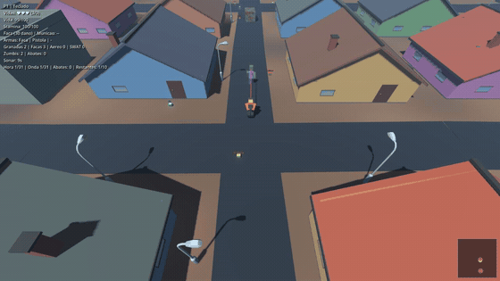

## 19 - Healer (curandeiro)

Vida base **150** &middot; velocidade **1.6**. Cura os zumbis perto e levanta cadaveres recentes.

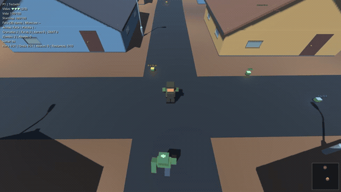

## 20 - Stalker (espreitador)

Vida base **80** &middot; velocidade **3.0**. Quase invisivel ate chegar perto; da o bote e prende.

