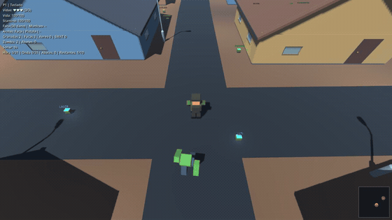
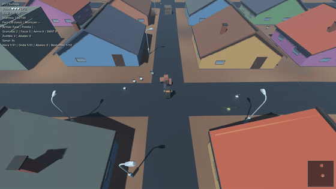

# Variantes de zumbi

Sao **21 variantes** (enum `ZombieMutator.Type`): o tipo muda aparencia, vida,
velocidade e habilidade. A onda sorteia um mix percentual por fase
(`survival_wave_schedule.gd`), o hash sincroniza o visual entre servidor e
clientes e as habilidades vivem em `zombie_variant_abilities.gd`.

Cada GIF abaixo foi gravado pelo proprio jogo: um zumbi da variante nasce na rua,
anda ate o jogador e ataca (`scripts/capture_shots.sh --shot=zumbi-NN`, com
`--write-movie` + ffmpeg; detalhes em `imagens/zumbis/README.md`).

| # | Variante | Vida base | Velocidade | O que ela faz |
|---|---|---|---|---|
| 00 | Walker | 100 | 2.2 | O classico: anda em linha reta para o jogador. |
| 01 | Um braco | 85 | 2.0 | Perdeu o braco esquerdo (sobra o coto). |
| 02 | Rastejante | - | - | Arrasta o corpo pelo chao, mais baixo que o normal. |
| 03 | Manco | 90 | 1.65 | Perna torta: anda devagar e torto. |
| 04 | Corredor | 70 | 3.1 | Magro e inclinado para frente, corre mais que o walker. |
| 05 | Braco pela metade | 90 | 2.1 | Braco esquerdo cortado no meio. |
| 06 | Uma perna | 80 | 1.5 | Perdeu a perna esquerda. |
| 07 | Perna pela metade | 85 | 1.6 | Perna direita cortada no meio; corpo inclinado. |
| 08 | Cabeca dividida | 95 | 2.3 | Cabeca partida em duas, anda rapido para o padrao. |
| 09 | Brute (tanque) | 550 | 1.15 | Lento, muito vida e golpe forte (26 de dano); corpo maior. |
| 10 | Screamer | 85 | 2.4 | Grita de tempo em tempo e atrai a horda pela audicao. |
| 11 | Bloater kamikaze | 140 | 3.2 | Inchado: corre e se joga no jogador para explodir colado. |
| 12 | Leaper | 70 | 2.6 | Magro e curvado: da um bote rapido quando chega perto. |
| 13 | Armored | 160 | 1.9 | Capacete e colete: tiro causa metade do dano, faca dano cheio. |
| 14 | Tita (chefe) | 10000 | 1.7 | Super zumbi das horas 10/20/30: pisao, invocacao de sprinters e furia. |
| 15 | Spitter (cuspidor) | 80 | 2.0 | Para a distancia e cospe uma poca de acido que queima. |
| 16 | Charger (investida) | 220 | 1.9 | Braco gigante: arranca em linha reta e arremessa o jogador. |
| 17 | Jumper (saltador) | 90 | 2.5 | Pernas longas: pula em arco e cai em cima do jogador. |
| 18 | Smoker (puxador) | 120 | 1.9 | De longe prende o jogador com a lingua e puxa ate a horda. |
| 19 | Healer (curandeiro) | 150 | 1.6 | Cura os zumbis perto e levanta cadaveres recentes. |
| 20 | Stalker (espreitador) | 80 | 3.0 | Quase invisivel ate chegar perto; da o bote e prende. |

Vida/velocidade sao os valores base definidos em `zombie_mutator.gd`
(algumas variantes ajustam mais coisas no proprio setup, como o Tita).

| Variante | GIF |
|---|---|
| 04 Corredor |  |
| 09 Brute |  |
| 14 Tita |  |
| 16 Charger |  |

Todos os 21 GIFs estao em [`imagens/zumbis/`](imagens/zumbis/), um arquivo por
variante no indice do enum (`zumbi-00.gif` ... `zumbi-20.gif`).
